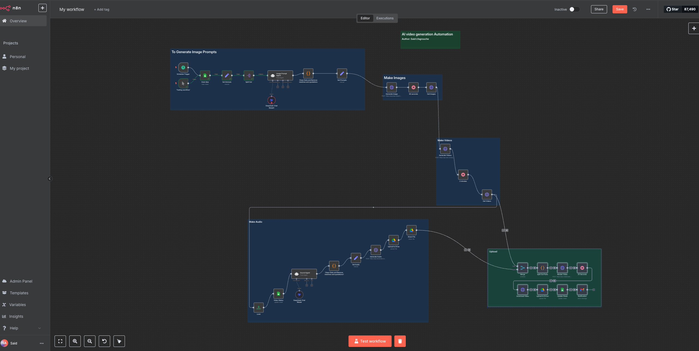

# 🎬 n8n AI Animal Fashion Video Generator

An end-to-end automation workflow powered by n8n that transforms simple animal and style inputs into engaging, professional short-form videos featuring animals dressed in various fashion styles.

## 🌟 Overview

This automation solves the challenge of creating high-quality, consistent fashion-themed animal videos at scale by leveraging modern AI tools. Perfect for content creators, marketing teams, or anyone looking to build an engaging social media presence with unique, eye-catching content.

### 🚀 Key Features

- **Fully Automated**: From concept to final video with zero manual steps
- **Consistent Quality**: Professionally structured videos with cohesive styling
- **Scalable**: Generate unlimited videos by simply adding rows to a spreadsheet
- **Multi-AI Integration**: Combines specialized AI tools for optimal results at each stage

## 🧩 How It Works

The workflow follows a structured pipeline process:

1. **Ideas Management**: Reads animal and style combinations from a Google Sheet
2. **Prompt Generation**: Creates specialized prompts for each animal using LLM orchestration
3. **Image Creation**: Generates high-quality images of animals in fashion attire
4. **Video Animation**: Transforms static images into realistic moving videos
5. **Audio Generation**: Creates ambient soundscapes matching the style theme
6. **Final Composition**: Combines all elements into a cohesive short-form video
7. **Publication**: Uploads the result and updates tracking information

## 🛠️ Technical Components

### AI Services Used

- **LLM for Prompt Creation**: DeepSeek for crafting detailed, style-specific prompts
- **Image Generation**: Flux AI for high-quality fashion animal imagery
- **Video Animation**: Runway Gen3 for life-like movement from static images
- **Audio Generation**: ElevenLabs for immersive, thematic soundscapes
- **Video Editing**: Creatomate for professional video assembly and transitions

### Storage & Management

- **Google Sheets**: Tracks video ideas, status, and published URLs
- **Google Drive**: Stores audio files and finished videos
- **Email Notifications**: Alerts when new videos are ready for review

## 📋 Setup Instructions

### Prerequisites

- [n8n](https://n8n.io/) account or self-hosted instance
- API keys for the following services:
  - DeepSeek
  - Piapi.ai (for Flux)
  - Runway ML
  - ElevenLabs
  - Creatomate
- Google account with Google Sheets and Drive access

### Google Sheet Template

Create a Google Sheet with the following columns:

| title | animal 1 | animal 2 | animal 3 | animal 4 | style | caption | videoStatus | publishStatus | videoLink |
|-------|----------|----------|----------|----------|-------|---------|-------------|---------------|-----------|
| Cyberpunk Fox | Fox | Raccoon | Owl | Wolf | Cyberpunk | | To Do | | |

- **title**: Your video project name
- **animal 1-4**: Four different animals to feature in the video
- **style**: Fashion/visual style (e.g., Cyberpunk, Victorian, Y2K, Cottage Core)
- **videoStatus**: Set to "To Do" for new videos (automation will update to "Created" when processed)
- **publishStatus**: Will be updated to "Processed" when complete
- **videoLink**: Will contain the final video URL

### Google Drive Folders

Create two folders in Google Drive:
1. Audio files folder (for storing generated soundscapes)
2. Final videos folder (for storing the completed videos)

You'll need the folder IDs for configuration.

## 🚀 Installation

1. Import the workflow JSON file into your n8n instance
2. Replace all placeholder API keys and credential IDs:
   - `<Your API Key>` with your actual API keys
   - `<Your Credential ID>` with your n8n credential IDs
   - `<Your Google Sheet ID>` with your Google Sheet ID
   - `<Your Google Drive Folder ID>` with your Google Drive folder IDs
   - `<Your Email>` with your notification email
   - `<Your Name>` with your name
   - `<Your Instance ID>` with your n8n instance ID

3. Configure authentication for all services:
   - Google Sheets account
   - Google Drive account
   - Gmail account
   - All API services (DeepSeek, Runway, ElevenLabs, Piapi.ai, Creatomate)

4. Activate the workflow and add your first video ideas to the Google Sheet

## 🎥 How Videos Are Generated

1. The workflow reads the next "To Do" row from your Google Sheet
2. It processes each animal with the specified style to create fashion-appropriate prompts
3. These prompts generate stylized images of each animal in matching outfits
4. The static images are animated to create a sense of the animal walking toward the viewer
5. A matching audio track is generated based on the style theme
6. All components are assembled into a single cohesive video
7. The final video is uploaded to Google Drive and the Sheet is updated with the link
8. You receive an email notification when a new video is ready

## ⚙️ Customization Options

- **Video Dimensions**: Modify the size parameters in the image generation node
- **Video Length**: Adjust duration in the video generation nodes
- **Style Variations**: Experiment with different style descriptions in your spreadsheet
- **Audio Duration**: Change the audio length parameter as needed

## 🧠 Prompt Engineering

The system uses carefully crafted prompt templates to ensure consistent, high-quality outputs:

- **Image Prompts**: Designed to create cinematic, forward-facing animals in thematic attire
- **Sound Prompts**: Structured to produce ambient soundscapes matching the style theme

Modify these prompt templates in the respective agent nodes if needed.

## 🔄 Flow Control

The automation includes:
- Timing controls with wait nodes to ensure API processes complete
- Error handling to prevent workflow failures
- Status tracking to monitor progress

## 📚 Resources

- [n8n Documentation](https://docs.n8n.io/)
- [DeepSeek API Docs](https://platform.deepseek.com/)
- [Runway ML Docs](https://docs.runwayml.com/)
- [ElevenLabs Documentation](https://docs.elevenlabs.io/)
- [Creatomate API Reference](https://creatomate.com/docs/api/rest-api/introduction)

## 📝 License

This project is licensed under the MIT License - see the LICENSE file for details.

## 🤝 Contributing

Contributions, issues, and feature requests are welcome! Feel free to check the issues page.
